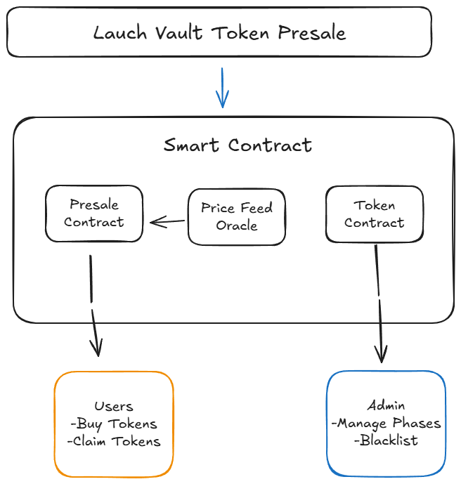
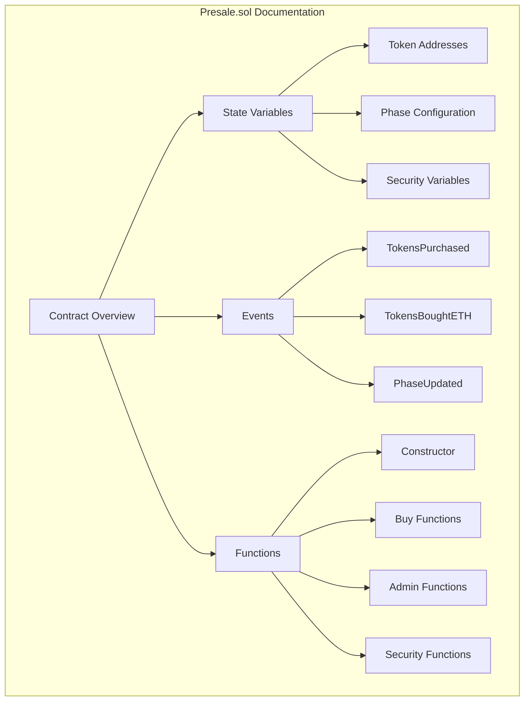
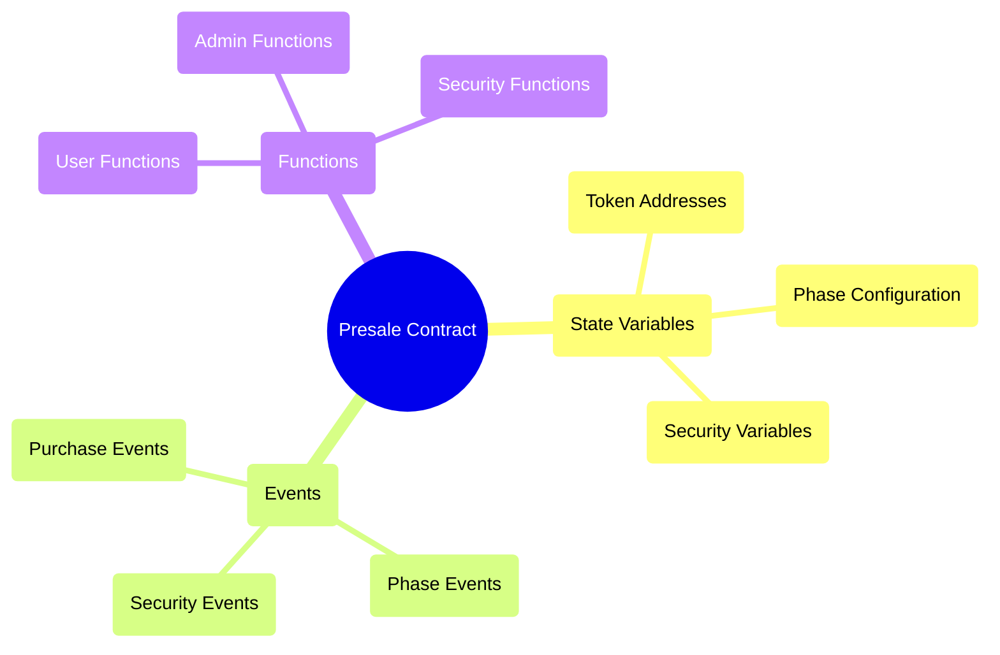
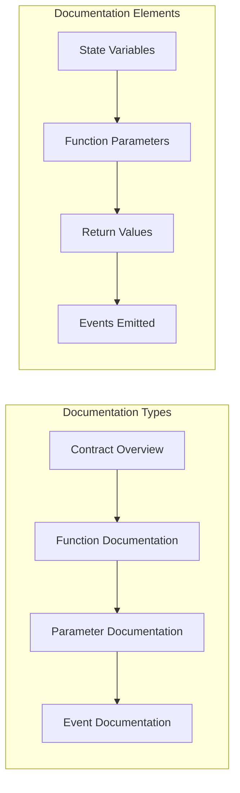
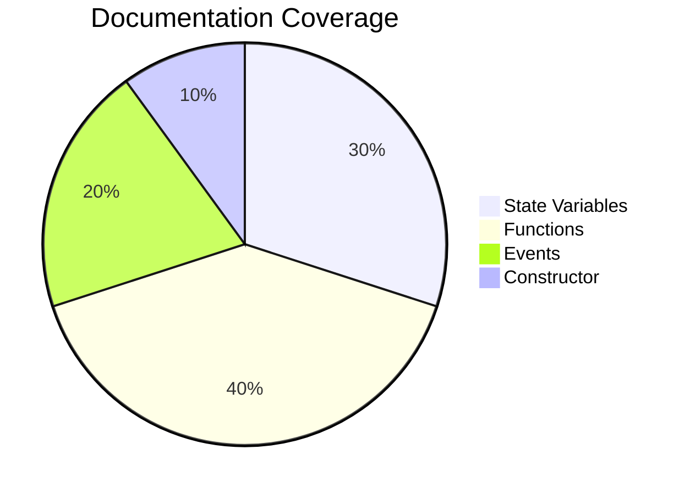
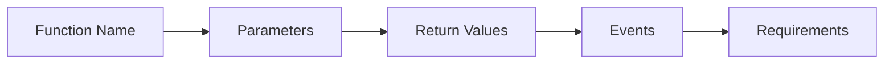
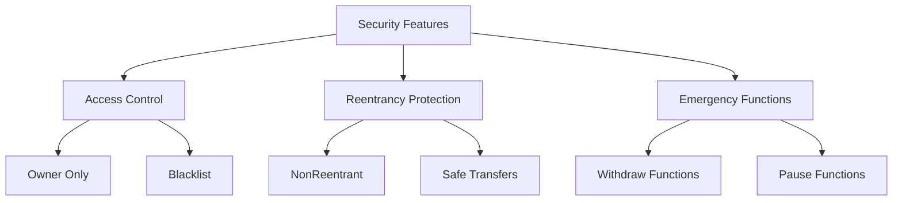

<h1 align="center" style="text-align: center;">🚀 Launch Vault Presale</h1>

<div align="center">
  
  
  
  
</div>

<br>

<div align="center">
  
  <p><em>Visual representation of the project's structure and components</em></p>
</div>


## 📋 Table of Contents

- [✨ Features](#features)
- [🏗 Architecture](#architecture)
- [🚀 Getting Started](#getting-started)
- [💻 Usage](#usage)
- [🧪 Testing](#testing)
- [🔒 Security](#security)
- [🤝 Contributing](#contributing)
- [📄 License](#license)

## ✨ Features

### 💰 Payment System
| Method | Description | Price |
|--------|-------------|--------|
| ETH | Direct Ethereum payment | Variable |
| USDT | Tether payment | Fixed |
| USDC | USD Coin payment | Fixed |

### 📊 Presale Phases


### 🔒 Security Features
- ✅ Reentrancy protection
- ✅ Address blacklisting
- ✅ Emergency functions
- ✅ Role-based access control

## 🏗 Architecture

### Project Structure


### Flow Diagram


### Flow Transactions


## 🚀 Getting Started

### Prerequisites
- [Git](https://git-scm.com/)
- [Foundry](https://getfoundry.sh/)
- [Node.js](https://nodejs.org/)

### Installation

1. Clone the repository
```bash
git clone https://github.com/yourusername/presale-contract.git
cd presale-contract
```

2. Install dependencies
```bash
forge install
```

3. Set up environment
```bash
cp .env.example .env
# Edit .env with your configuration
```

## 💻 Usage


### Contract Interaction

#### For Users
```solidity
// Buy tokens with ETH
function buyTokensEth() external payable

// Buy tokens with USDT/USDC
function buyTokensERC20(address tokenUsedToBuy_, uint256 amount_) external

// Claim purchased tokens
function claimTokens() external
```

#### For Administrators
```solidity
// Blacklist management
function addToBlacklist(address user_) external
function removeFromBlacklist(address user_) external

// Emergency functions
function emergencyWithdrawERC20(address tokenAddress_, uint256 amount_) external
function emergencyWithdrawEth() external
```

## �� Code Documentation

### Contract Structure


### Key Documentation Elements


### Documentation Flow


### Documentation Coverage


### Function Documentation Structure


### Security Documentation



## 🧪 Testing

### Running Tests
```bash
# Run all tests
forge test

# Run specific test
forge test --match-path test/Presale.t.sol

# Run with verbosity
forge test -vvv
```

### Test Coverage
```bash
forge coverage
```

## 🔒 Security

### Audit Status
| Type | Status |
|------|--------|
| Static Analysis | ✅ Completed |
| Unit Tests | ✅ Completed |
| External Audit | ⏳ Pending |

### Security Measures
- 🔒 Reentrancy protection
- 🔑 Access control
- 🧮 Safe math operations
- 🚨 Emergency functions
- ⚠️ Blacklist capability

## 🤝 Contributing

1. Fork the repository
2. Create your feature branch
```bash
git checkout -b feature/AmazingFeature
```
3. Commit your changes
```bash
git commit -m 'Add some AmazingFeature'
```
4. Push to the branch
```bash
git push origin feature/AmazingFeature
```
5. Open a Pull Request

## 📄 License

This project is licensed under the MIT License - see the [LICENSE](LICENSE) file for details.

---

<div align="center">
  <sub>Built with ❤️ by Your Name</sub>
</div>


